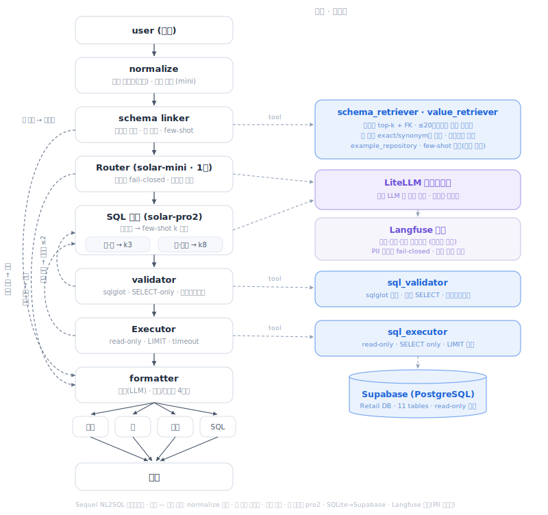
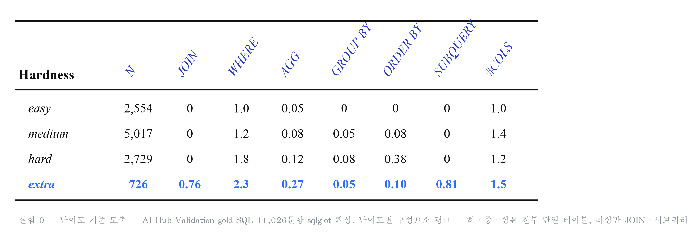
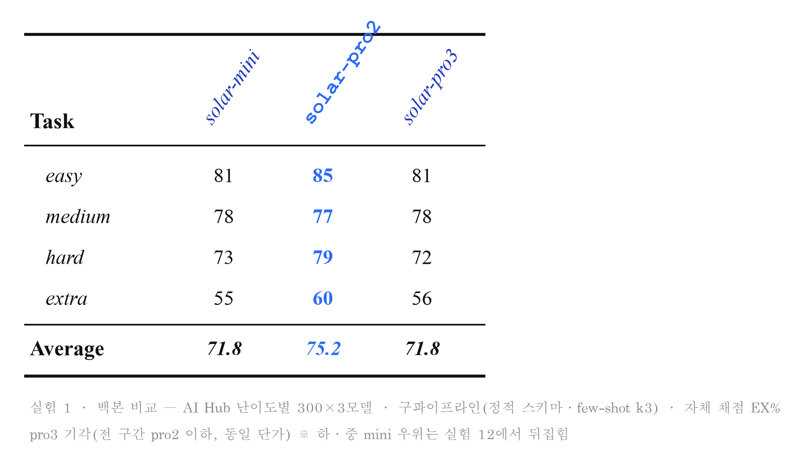
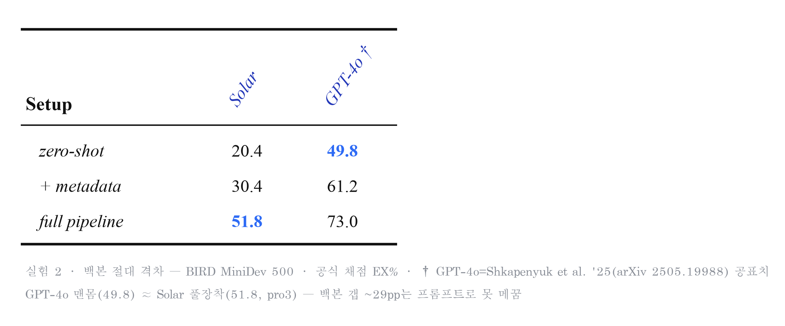
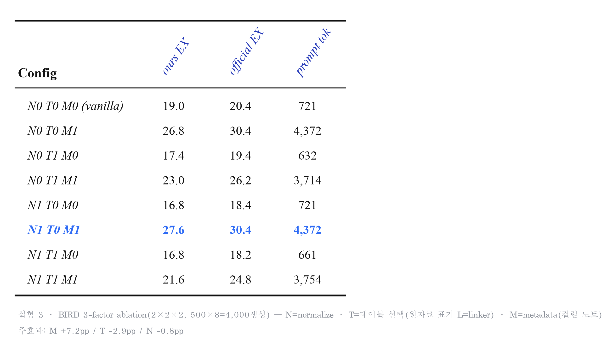
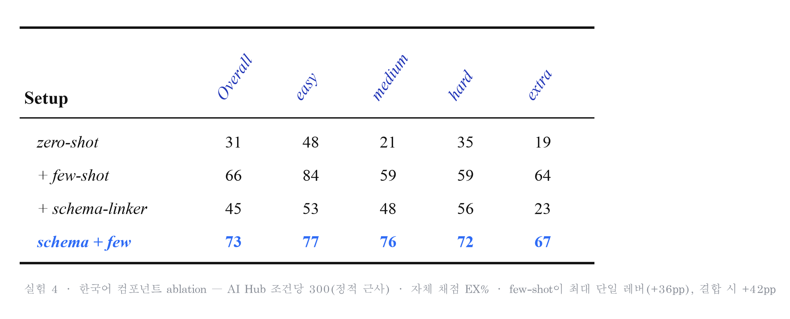
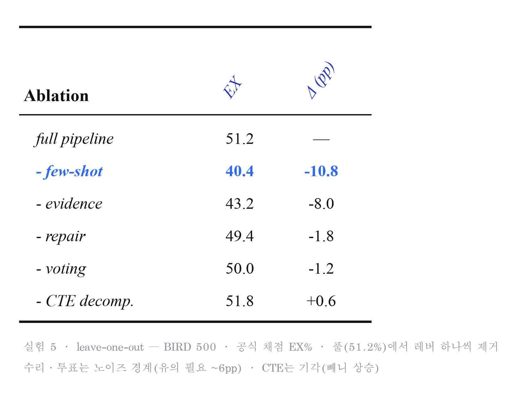
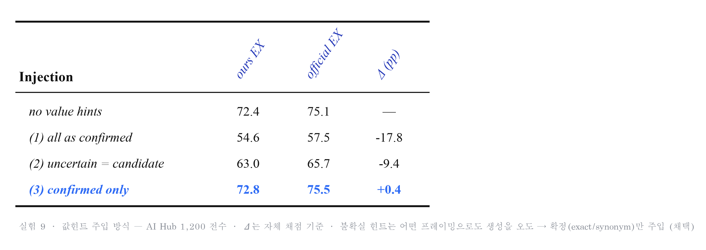
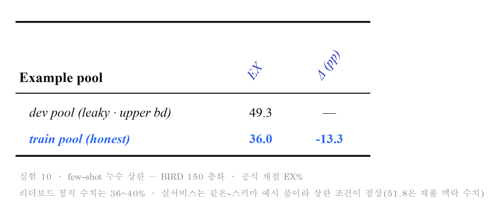
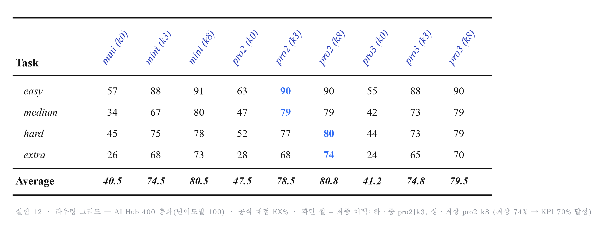

# Sequel

자연어로 질문하면 SQL을 몰라도 데이터베이스에서 바로 답을 받는 한국어 Text-to-SQL 서비스.

> "카테고리별 주문 수 알려줘" → 에이전트가 SQL을 생성·검증·실행하고, 결과를 표와 요약으로 보여준다.

- 배포 주소: https://text2sql-frontend-bfkt3wk5mq-du.a.run.app

---

## 1. 프로젝트 소개

- **한 줄 소개**: 자연어 질문을 SQL로 바꿔 실행하고, 결과를 표·차트·요약으로 돌려주는 웹 서비스.
- **주요 사용자**: 데이터는 DB에 있는데 SQL을 다루지 못하는 실무자.
- **배경**: 가천대 2026 AI 부트캠프 team07 프로젝트. 한국어 질문 + 한국어 도메인 값(주문 상태, 결제 수단 등)을 실제 서비스 수준으로 처리하는 것이 목표.
- **결과물**: GCP에 배포된 웹 서비스 (프론트엔드 · 백엔드 · AI 에이전트 · DB 4계층).

```
[사용자] → [React 프론트엔드 (Cloud Run)]
              → [FastAPI 백엔드 (GCE VM) — SQL 재검증 게이트웨이]
                  → [AI 에이전트 (GCE VM) — LangGraph Text-to-SQL 파이프라인]
                      → [Supabase Postgres — 읽기 전용 계정]
```

| 영역 | 기술 |
|---|---|
| AI 에이전트 | LangGraph, LiteLLM, Upstage Solar (solar-pro2 생성 · solar-mini 분류), sqlglot |
| 백엔드 | FastAPI, SQLAlchemy, SSE 스트리밍 |
| 프론트엔드 | React 18 + Vite (추가 UI 라이브러리 없음) |
| DB | Supabase (Postgres) — Olist 이커머스 등 11개 테이블 |
| 관측 | Langfuse (트레이싱·비용) + 로컬 트레이스 로그 |
| 인프라 | GCP (Cloud Run, GCE VM, VPC, HTTPS LB), Docker, GitHub Actions CI/CD |

---

## 2. 문제 정의

- 데이터 조회가 필요한 사람과 SQL을 쓸 수 있는 사람이 다르다. 간단한 집계 하나도 개발자를 거쳐야 한다.
- LLM에게 그냥 SQL을 시키면 실제 서비스에서 바로 문제가 생긴다.
  - 스키마를 모르고 생성해 없는 테이블·컬럼을 참조한다.
  - 한국어 질문 속 값("배송완료", "취소")과 DB 저장값(`delivered`, `canceled`)이 다르다.
  - 모호한 질문("삼성 매출" — 삼성전자? 삼성물산?)에 아무 SQL이나 만들어 틀린 답을 확신 있게 내놓는다.
  - DELETE·DROP 같은 위험한 쿼리를 막을 장치가 없다.
- 여기에 하나 더: 우리가 쓸 수 있는 백본(Solar)은 GPT-4o보다 확연히 약하다. 모델 교체 없이 이 격차를 어디까지 메꿀 수 있는지가 실질적인 과제였다.

---

## 3. 문제 해결

### 파이프라인

질문 하나가 7개 노드를 통과한다. 각 노드의 실패는 버리지 않고 경로를 바꾼다.



```
normalize → schema_link → route → generate → validate → execute → format
```

| 노드 | 역할 |
|---|---|
| normalize | 질문에서 키워드 추출, 모호성 표시 |
| schema_link | 관련 테이블 선별 + 키워드를 실제 DB 값으로 해소 (exact → synonym → fuzzy → embedding 폴백 체인) |
| route | 안전성 판정(위험 질문 거절) + 난이도 분류(하/중/상/최상) |
| generate | 난이도별 few-shot(k3/k8)과 M-Schema를 넣어 SQL 생성 |
| validate | 실행 전 하드 게이트 — SELECT 단일 문장만, 링크된 테이블 화이트리스트 (sqlglot, LLM 안 씀) |
| execute | 읽기 전용 실행. 런타임 오류는 오류 메시지를 붙여 재생성으로 되돌림 |
| format | 결과 요약. 실패 경로별로 안내 메시지 분기 |

### 실패 처리 원칙

- **검증·실행 실패 → 오류 피드백 재생성**: 실패 이유를 프롬프트에 붙여 다시 생성한다(최대 재시도 소진 시 안내로 종료).
- **값이 모호하면 되묻는다**: DB에 근접 값이 둘 이상 실재할 때만 생성을 멈추고 사용자에게 선택지를 준다. 불확실한 힌트로 생성하면 정확도가 크게 떨어지기 때문(실험 9, −17.8pp).
- **안전성은 fail-closed**: 판정 응답이 누락돼도 거절로 처리한다.

### 이중 방어 (defense-in-depth)

에이전트가 만든 SQL을 백엔드가 그대로 신뢰하지 않는다. 백엔드가 guardrail 재검증(SELECT/WITH만 허용, 위험 키워드 차단, LIMIT 강제) → 자체 재실행 → 결과 검증까지 독립적으로 수행하고, DB 계정 자체도 SELECT만 가능한 읽기 전용이다.

### 약한 백본을 메꾼 방법

실험으로 확인한 결론은 "구조(수리·투표)가 아니라 컨텍스트(few-shot·스키마 정보)가 정확도를 올린다"였다.

- **few-shot**: 시드 26개 + 임베딩 top-k 검색, 난이도별 k3/k8 주입 — 최대 단일 레버(+36pp).
- **M-Schema 메타데이터**: 90개 컬럼 프로파일 + 한국어 설명을 컬럼당 한 줄로 압축 — 프롬프트 1/3로 줄이고 정확도 유지.
- **확정 값힌트만 주입**: exact/synonym 매칭만 프롬프트에 넣고, 유사도 매칭은 되묻기 용도로만 보존.

---

## 4. 핵심 기능

- 자연어 질문 → SQL 생성 → 실행 결과를 표·차트·요약으로 제공
- 노드별 진행 상황 실시간 스트리밍(SSE) — "SQL을 생성하는 중…" 단계 표시
- 세션 기반 후속 질문 — "그 중에 1위만 알려줘"가 이전 맥락으로 이어짐
- 답변 후 추천 질문 칩 — 클릭하면 그대로 다음 질문으로
- 모호한 값 되묻기 — 비슷한 값이 여러 개면 선택지를 제시
- 4중 안전장치 — 에이전트 검증 + 백엔드 guardrail + 결과 검증 + 읽기 전용 DB 계정
- 홈(KPI 대시보드)/질문하기/히스토리/저장 4화면 UI, 결과 CSV 내보내기
- 난이도 라우팅 — 질문 난이도를 분류해 few-shot 규모(k3/k8) 조절

---

## 5. 실험 결과

기간 2026-07-09 ~ 07-13, 채점은 실행 결과 일치(EX). 전체 기록은 [docs/실험_총정리_v2.md](docs/실험_총정리_v2.md), 원자료는 `bench/results_*.jsonl`.

| 데이터셋 | 용도 | 규모 |
|---|---|---|
| AI Hub NL2SQL (한국어) | 실서비스 조건 — 라우팅·컴포넌트 검증 | 1,200문항(난이도별 300) |
| BIRD MiniDev (영어) | 외부 절대 앵커 — 리더보드 스케일 위치 확인 | 500문항 |

**요약**: 백본(Solar)과 GPT-4o의 격차는 프롬프트로 못 메꾼다. 대신 컨텍스트 레버(few-shot·metadata)로 한국어 벤치 최상 난이도 60% → 74%까지 끌어올렸고, 그 과정에서 "불확실한 힌트는 오히려 독"이라는 가장 견고한 발견(−17.8pp)을 얻었다.

### 실험 0 · 난이도 4단계 기준 도출

AI Hub gold SQL 11,026문항을 sqlglot으로 파싱해 난이도별 SQL 구성요소를 집계했다. 하·중·상은 전부 단일 테이블이고, JOIN·서브쿼리는 최상에서만 나타난다. 이 경계로 라우터의 분류 기준을 정의했다.



| 난이도 | 정의 | 질문 신호 |
|---|---|---|
| 하 | 단일 테이블, 조건 1개 | "X의 Y 알려줘" |
| 중 | 단일 테이블, 가벼운 집계/그룹 | "몇 개", "합계", "~별" |
| 상 | 단일 테이블, 다중 조건 + 정렬/랭킹 | "가장 많은", "top N" |
| 최상 | 여러 테이블 JOIN, 중첩 비교 | 엔티티 결합, "평균보다" |

### 실험 1 · Solar 3종 백본 비교

한국어 1,200문항(난이도별 300)에서 mini/pro2/pro3를 비교했다. pro3는 동일 단가인데 전 구간 pro2 이하라 제외.



| 난이도 | mini | pro2 | pro3 |
|---|---|---|---|
| 하 | 81% | **85%** | 81% |
| 중 | 78% | 77% | 78% |
| 상 | 73% | **79%** | 72% |
| 최상 | 55% | **60%** | 56% |

### 실험 2 · 백본 절대 격차 (vs GPT-4o)

BIRD 500문항에서 우리 실측과 논문 공표치(AT&T AskData, arXiv 2505.19988)를 비교했다.



| 백본 | 조건 | EX |
|---|---|---|
| solar-pro2 | 맨몸(zero-shot) | 20.4% |
| GPT-4o | 맨몸 | **49.8%** |
| solar-pro3 | 풀 파이프라인 | **51.8%** |
| GPT-4o | 풀 파이프라인 | 73.0% |

GPT-4o 맨몸 ≈ Solar 풀장착. 백본 갭 약 29pp는 프롬프트 엔지니어링으로 메꿀 수 없다. 다만 기법에 의한 상승폭은 우리(+31pp)가 논문(+23pp)보다 크다 — 부족한 것은 엔지니어링이 아니라 모델이다. (단, 동일 하네스 대조는 API 키 부재로 못 돌려 정황 근거임을 명시한다.)

### 실험 3·4 · 무엇이 정확도를 올리나 (ablation)

BIRD 2×2×2 ablation(4,000생성)과 한국어 컴포넌트 ablation을 돌렸다.




| 요인 | 효과 | 반영 |
|---|---|---|
| few-shot | 한국어 +36pp — 최대 단일 레버 | 켠다 (난이도별 k3/k8) |
| metadata | BIRD +7.2pp | 켠다 (M-Schema로 토큰 1/3 압축) |
| schema linker | BIRD −2.9pp — 작은 스키마에선 해로움 | 테이블 20개 이하면 우회 |

### 실험 5 · 레버별 기여도 (leave-one-out)

BIRD 풀 파이프라인(51.2%)에서 레버를 하나씩 빼며 기여도를 측정했다.



| 제거 레버 | 기여 | 판정 |
|---|---|---|
| few-shot | −10.8pp | 최대 |
| evidence | −8.0pp | 대형 |
| 오류 수리 | −1.8pp | 유효하나 소폭 |
| 다중후보 투표 | −1.2pp | 비용 2.5배 — 기각 |
| CTE 분해 | +0.6pp (빼니 상승) | 기각 |

정확도를 지배하는 것은 컨텍스트 레버이고, 구조 레버는 다 합쳐 ~3pp였다.

### 실험 9 · 불확실 값힌트의 역설 (핵심 발견)

스키마 링커가 찾은 값 힌트를 프롬프트에 어떻게 넣을지 한국어 1,200문항 전수로 실험했다.



| 주입 방식 | EX(공식) | Δ |
|---|---|---|
| 힌트 없음 | 75.1% | 기준 |
| 전부 확정으로 주입 | 57.5% | **−17.8pp** |
| "후보(단정 금지)"로 완화해 주입 | 65.7% | −9.4pp |
| **확정 매칭만 주입** | **75.5%** | +0.4pp |

불확실한 힌트는 어떤 프레이밍으로도 생성기를 오도한다. n=1,200에서 강하게 유의한, 이 프로젝트에서 가장 견고한 발견. 제품에는 exact/synonym 매칭만 프롬프트에 넣고, 유사도 매칭은 되묻기 UX로만 쓴다.

### 실험 10 · few-shot 누수 검증

BIRD few-shot 예시를 평가셋(dev풀)에서 뽑으면 49.3%, 누수 없는 train풀로 바꾸면 36.0%다. 리더보드용 정직 수치는 36~40%로 분리해서 쓴다. 다만 실서비스는 같은 스키마의 시드 예시를 쓰는 구조라 상한 조건이 정상 — 제품 맥락에서는 51.8%가 유효하다.



### 실험 12 · 라우팅 그리드 (최종 확정)

확정 파이프라인 위에서 모델 3종 × few-shot k 3종 = 9셀 그리드를 돌려 최종 라우팅을 정했다.



| 난이도 | 모델 | few-shot k | 결과 |
|---|---|---|---|
| 하 | pro2 | 3 | 90% |
| 중 | pro2 | 3 | 79% |
| 상 | pro2 | 8 | 80% |
| 최상 | pro2 | 8 | **74% — KPI 70% 달성** |

최상 난이도 여정: 60%(초기) → 68%(수리·값필터) → 74%(k8).

### 실험의 한계

숨기지 않고 적는다. 상세는 [docs/실험_총정리_v2.md](docs/실험_총정리_v2.md)의 "실험의 한계" 절.

- 셀당 n=100~150인 결정(라우팅 미세 튜닝, M-Schema +2pp 등)은 노이즈 범위 — 방향 참고용이다. 통계적으로 살아남는 결론은 few-shot·metadata·evidence의 대격차와 값힌트 −17.8pp.
- GPT-4o 대조는 타 논문 하네스 수치라 통제군이 없다.
- 튜닝셋과 평가셋이 같아 최종 수치에 낙관 편향 가능성이 있다.
- 스키마 리트리버 recall, 난이도 분류기 자체 정확도는 미측정.

---

## 6. 데모 영상

- 배포 URL: https://text2sql-frontend-bfkt3wk5mq-du.a.run.app
- 데모 영상: https://drive.google.com/file/d/1iIiIH2jIcs_ZBI33IpL84rxb3iuTFYPo/view

---

## 7. 팀원 소개

| 이름 | 역할 | GitHub |
|---|---|---|
| 권도윤 | PM, AI 에이전트(LangGraph 파이프라인·실험·벤치마크), 프론트엔드, 백엔드 | [@Doyunamic-Kwon](https://github.com/Doyunamic-Kwon) |
| 이후윤 | 백엔드, 인프라(GCP·CI/CD), DB, 프론트엔드, Design | [@2yoon420](https://github.com/2yoon420) |

---

## 8. 참고자료 / 발표자료

**프로젝트 문서** (`docs/`)

- [PROJECT_OVERVIEW.md](docs/PROJECT_OVERVIEW.md) — 시스템 전체 구성·인프라·운영 정리
- [실험_총정리_v2.md](docs/실험_총정리_v2.md) — 실험 13건 전체 기록과 비판적 검토
- [파이프라인_정리.md](docs/파이프라인_정리.md) — 노드별 상세 설계
- [스키마링커_정리.md](docs/스키마링커_정리.md) — 스키마 링킹·값 해소 상세
- [api.md](docs/api.md) — 에이전트 API 계약
- [Sequel 프로젝트 기획서.pdf](docs/Sequel%20프로젝트%20기획서.pdf)
- [발표자료] https://docs.google.com/presentation/d/1AtqVNu1vaXqk1ga_bGW66v9H1DWxMG4ky4O_iHh02uo/edit?slide=id.g3f169a78542_1_130#slide=id.g3f169a78542_1_130
**참고 논문·자료**

- MapleRepair (arXiv 2501.09310) — 오류 피드백 재생성·selective 힌트 원칙
- AT&T AskData (arXiv 2505.19988) — BIRD 상한 참조치
- 데이터: AI Hub 자연어 기반 질의(NL2SQL) 데이터, BIRD MiniDev, Olist 브라질 이커머스
