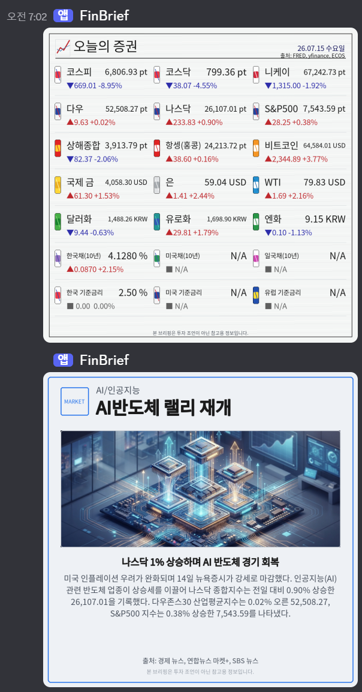

# FinBrief

## 1. 프로젝트 소개

> FinBrief는 선택한 금융 토픽의 지표와 흐름을 분석하여 아침 브리핑을 제공하는 AI 서비스입니다.

**FinBrief**는 사용자가 관심 있는 금융 토픽을 구독하면 실제 시장 지표 흐름과 최신 뉴스를 종합하여 매일 아침 Discord로 브리핑해주는 AI 금융 리포트 서비스입니다.

주요 사용자는 매일 시장 지표와 뉴스를 빠르게 확인하고 싶은 개인 투자자, 금융 초보자, 경제 뉴스 구독자입니다.

FinBrief는 흩어진 금융 지표, 뉴스, 토픽별 변동 근거를 한 번에 정리해 사용자가 아침에 짧은 시간 안에 시장 흐름을 파악할 수 있도록 돕습니다.

최종 결과물은 Discord 챗봇을 통해 주요 지표 이미지 리포트, 토픽별 카드뉴스로 제공됩니다.

---

## 2. 문제 정의

금융 시장을 확인하려면 사용자가 여러 사이트와 앱을 오가며 지수, 환율, 금리, 원자재, 가상자산, 관련 뉴스를 따로 확인해야 합니다.

기존 방식의 한계는 다음과 같습니다.

- 관심 있는 토픽만 골라 매일 자동으로 받아보기 어렵습니다.
- 지표 변화와 관련 뉴스 근거를 함께 보기 어렵습니다.
- 초보 사용자는 어떤 지표를 봐야 하는지 판단하기 어렵습니다.
- 매일 반복적으로 같은 정보를 찾는 데 시간이 많이 듭니다.

FinBrief는 이 문제를 "**관심 토픽 기반 AI 자동 브리핑**"으로 해결합니다.

---

## 3. 문제 해결

FinBrief는 사용자가 Discord 챗봇으로 관심 토픽을 구독하면, 매일 아침 외부 금융 데이터와 뉴스 RSS를 수집하고 AI가 핵심 내용을 요약해 금융 리포트와 카드 뉴스 형태로 전달합니다.

전체 동작 흐름은 다음과 같습니다.

```text
사용자 키워드 입력
  -> 토픽 매칭 및 구독 저장
  -> FRED, yfinance, 한국은행 ECOS, RSS 데이터 수집
  -> Supabase 저장 및 뉴스 임베딩
  -> RAG 기반 관련 뉴스 검색
  -> LangGraph 기반 카드뉴스/리포트 생성
  -> Discord 및 웹 화면으로 결과 제공
  -> Langfuse로 LLM 호출과 챗봇 대화 추적
```

핵심 아이디어는 사용자가 직접 금융 데이터를 찾아다니는 대신, 관심 토픽만 등록하면 필요한 지표와 뉴스 흐름을 자동으로 받아볼 수 있도록 하는 것입니다.

FinBrief는 이 과정에서 발생하는 비용과 시간을 절약해주고, 금융 관련 정보를 체계적으로 접할 수 있게 돕습니다.

---

## 4. 핵심 기능

- Discord 챗봇 기반 관심 토픽 구독, 조회, 삭제
- 자연어 키워드 기반 토픽 매칭 및 후보 추천
- 주요 지표 전체 리포트 이미지 생성
- 구독 토픽별 카드뉴스 생성
- FRED, yfinance, 한국은행 ECOS, 뉴스 RSS 기반 실데이터 수집
- Supabase PostgreSQL 및 pgvector 기반 RAG 검색
- 당일 리포트에서 변동이 큰 지표 설명
- 카드뉴스 작성에 사용된 뉴스 출처 설명
- LiteLLM 기반 LLM 호출, Guardrail, Fallback
- Langfuse 기반 리포트 실행, LLM 호출, 챗봇 대화 관측
- Docker Compose 및 GitHub Actions 기반 배포 자동화

---

## 5. 데모 영상

- 데모 영상: [데모 영상](https://drive.google.com/file/d/1bvIoGhafX-Vj6hZNtHcHMVZAOvjXPyVT/view?usp=sharing)
- 배포 URL: [소개 웹페이지](http://34.50.41.2:8000/) / [디스코드 봇](https://discord.com/oauth2/authorize?client_id=1524583710505041950&permissions=34816&integration_type=0&scope=bot+applications.commands)
- GitHub Repository: [FinBrief](https://github.com/RyuGernwoo/FInBrief)
- 추가 자료: 

대표 사용 예시는 다음과 같습니다.

```text
/finbrief message: 나스닥 구독해줘
/finbrief message: 내 토픽 보여줘
/finbrief message: 오늘 리포트에서 뭐 봐야 해?
/finbrief message: 오늘 카드뉴스 출처 알려줘
```

---

## 6. 팀원 소개

| 이름 | 역할 | GitHub |
|---|---|---|
| 류건우 | FastAPI, Supabase DB, RAG, CI/CD, Langfuse, GCE Infra, Docker, LLMOps | @RyuGernwoo |
| 이호민 | LangGraph, RAG, LiteLLM, Discord ChatBot, Webpage, LLMOps | @LeeHome2 |

---

## 7. 참고자료 / 발표자료

- 상세 README: [README_DETAIL.md](files/README_DETAIL.md)
- 발표자료: [발표자료](https://docs.google.com/presentation/d/1gAJZMaWaiphCOfIBMWRUbWzpxpaekBtgRpbDIWftlV8/edit?slide=id.g3f169a78542_2_266#slide=id.g3f169a78542_2_266)
- 기획서: [FinBrief 기획서 및 7일 로드맵](files/FinBrief_기획서_및_7일_로드맵.md)
- 시스템 문서: [제품 기능 명세](files/FinBrief_제품_기능_명세.md), [시스템 아키텍처](files/FinBrief_시스템_아키텍처.md), [데이터 흐름](files/FinBrief_데이터_흐름.md), [API 명세](files/FinBrief_API_명세.md)
- 참고한 기술:
  - FastAPI
  - LangGraph
  - LiteLLM
  - Langfuse
  - Supabase PostgreSQL + pgvector
  - Discord.py
  - Docker, GitHub Actions, GCP Compute Engine

---

## Docker 실행

개발자용 상세 실행 방법은 [README_DETAIL.md](files/README_DETAIL.md)에 정리되어 있습니다. 기본 실행은 다음 명령을 사용합니다.

```powershell
docker compose up -d --build
```

---

## CI/CD

FinBrief는 GitHub Actions에서 `FinBrief CI`와 `FinBrief CD` 워크플로를 사용합니다.

- `FinBrief CI`: Python compile, pytest, Docker build 검증
- `FinBrief CD`: GHCR 이미지 빌드/푸시, GCE Docker Compose 배포, health check, rollback

GCE 배포에는 GitHub Secrets 설정이 필요합니다. 대표적으로 `GCE_HOST`, `GCE_USERNAME`, `GCE_SSH_KEY`, `SUPABASE_URL`, `SUPABASE_SERVICE_ROLE_KEY`, `UPSTAGE_API_KEY`, `DISCORD_BOT_TOKEN`, `FINBRIEF_TRACE_SALT` 등을 등록해야 합니다.
